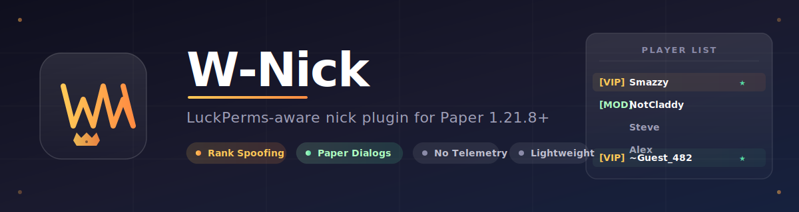

<h1 align="center">W-Nick</h1>

<p align="center">
  <i>A lightweight, privacy-respecting nick plugin for Paper 1.21.8+ with LuckPerms rank spoofing and Paper Dialog API integration.</i>
  <br/><br/>
  
  <br/><br/>
  <b><a href="https://github.com/Sxnpaiwin/W-nicks/releases">Download</a></b> | <b><a href="https://github.com/Sxnpaiwin/W-nicks/wiki">Documentation</a></b> | <b><a href="https://github.com/Sxnpaiwin/W-nicks/issues">Issues</a></b>
  <br/><br/>
  <a href="https://github.com/Sxnpaiwin/W-nicks/releases"></a>
  <a href="https://github.com/Sxnpaiwin/W-nicks/releases"></a>
  <a href="https://github.com/Sxnpaiwin/W-nicks/commits/main"></a>
  <a href="https://papermc.io"></a>
  <a href="https://github.com/Sxnpaiwin/W-nicks/blob/main/LICENSE"></a>
  <a href="https://github.com/Sxnpaiwin/W-nicks/releases"></a>
  <br/><br/>
  
</p>

---

<details>
  <summary><b>📖 Table of Contents</b></summary>

- [✨ Features](#-features)
- [🚀 Quick Start](#-quick-start)
- [📋 Commands](#-commands)
- [🔐 Permissions](#-permissions)
- [⚙️ Configuration](#️-configuration)
- [💾 Storage](#-storage)
- [🔒 Privacy](#-privacy)
- [🧪 Testing](#-testing)
- [📦 Building from Source](#-building-from-source)
- [📖 Documentation](#-documentation)
- [🙏 Credits](#-credits)

</details>

---

## ✨ Features

### 🎭 Nicking
- **`/nick as <name>`** — Nick as another player (copies skin + name)
- **`/nick with_name <name>`** — Set a custom nickname
- **`/nick with_skin <player>`** — Copy another player's skin
- **`/nick from_url <url>`** — Apply a Mineskin skin
- **`/nick reset`** — Restore your original name and skin
- **`/randomnick`** — Generate a random nick with a random rank

### 🏷️ LuckPerms Rank Spoofing
- **`/nickrank list`** — Preview every LuckPerms group with prefix + suffix
- **`/nickrank set <rank>`** — Set your fake rank (tab-completes, case-insensitive)
- **`/nickrank random`** — Pick a random assignable rank
- **`/nickrank current`** — Show your current rank + preview
- Pass **`-r <rank>`** to any nick command to set the rank inline
- **TAB sorting support** — spoofed rank respects TAB's sorting configuration

### 🪟 Paper Dialog API
- **`/wnick guide`** — Interactive in-game dialog with clickable action buttons
- Shows live nick status and one-click shortcuts for every command
- Requires Paper 1.21.8+

### 🔄 Quality of Life
- **Auto-apply on join** — reconnecting players get their nick back automatically
- **Configurable message prefix** — MiniMessage formatting supported
- **PlaceholderAPI integration** — `%wnick_nickname%`, `%wnick_fake_rank%`, etc.
- **Folia support**

---

## 🚀 Quick Start

1. **Install [Paper 1.21.8+](https://papermc.io)** — required for the Dialog API
2. **Install [LuckPerms](https://luckperms.net/)** — required for rank spoofing
3. *(Optional)* Install [TAB](https://github.com/NEZNAMY/TAB) and [PlaceholderAPI](https://github.com/HelpChat/PlaceholderAPI)
4. **Download** `W-Nick-1.0.81.jar` from the [releases page](https://github.com/Sxnpaiwin/W-nicks/releases)
5. **Drop it** into `plugins/` and **restart** your server
6. **Tag a group as randomly assignable:**
   ```bash
   /lp group vip permission set wnick.rank.assignable true
   ```
7. **In-game**, run `/wnick guide` to open the interactive dialog, or:
   ```bash
   /nickrank list        # see available ranks
   /nickrank set vip     # pick a rank
   /nick as Smazzy       # nick yourself with that rank
   ```

---

## 📋 Commands

### `/nick` — Set, reset, or change your nickname

| Command | Description |
|---------|-------------|
| `/nick` | Show help |
| `/nick as <name> [-r <rank>]` | Nick as another player (copies skin + name) |
| `/nick with_name <name> [-r <rank>]` | Set a custom name (keeps your skin) |
| `/nick with_skin <player>` | Copy another player's skin |
| `/nick from_url <url\|id>` | Apply a Mineskin skin |
| `/nick reset` | Restore your original name and skin |
| `/nick <player> <action> [name]` | Act on another player |

### `/randomnick` — Generate a random nickname

| Command | Description |
|---------|-------------|
| `/randomnick` | Random nick for yourself |
| `/randomnick -r <rank>` | Random nick with a specific rank |
| `/randomnick @a -r vip --skip` | Random nick for all players, skipping already-nicked |

### `/nickrank` — Manage your fake rank

**Aliases:** `/nr`, `/fakerank`

| Command | Description |
|---------|-------------|
| `/nickrank list [all\|assignable]` | List LuckPerms groups with prefix/suffix preview |
| `/nickrank set <rank> [targets]` | Set your fake rank |
| `/nickrank clear [targets]` | Clear your fake rank |
| `/nickrank random [targets]` | Pick a random assignable rank |
| `/nickrank current [target]` | Show current rank + preview |

### `/wnick` — Master command

**Alias:** `/wn`

| Command | Description |
|---------|-------------|
| `/wnick` | Show help |
| `/wnick guide` | Open the interactive Paper Dialog (1.21.8+) |
| `/wnick info [player]` | Full debug view |
| `/wnick version` | Show installed version |
| `/wnick reload` | Reload config |

### `/realname <nick>` — Look up who's behind a nick

---

## 🔐 Permissions

All permissions use the `wnick.*` namespace.

<details>
<summary><b>View all permissions</b></summary>

| Permission | Default | Description |
|------------|---------|-------------|
| `wnick.commands.nick` | op | Access to `/nick` |
| `wnick.commands.nick.others` | op | Nick other players |
| `wnick.commands.nick.reset` | op | `/nick reset` |
| `wnick.commands.nick.reset_all` | op | `/nick reset_all` |
| `wnick.commands.nick.save_all` | op | `/nick save_all` |
| `wnick.commands.nick.save_cached` | op | `/nick save_cached` |
| `wnick.commands.randomnick` | op | Access to `/randomnick` |
| `wnick.commands.randomnick.others` | op | Random-nick other players |
| `wnick.commands.realname` | true | Access to `/realname` |
| `wnick.commands.nickrank` | op | Access to `/nickrank` |
| `wnick.commands.nickrank.list` | op | List ranks |
| `wnick.commands.nickrank.set` | op | Set a fake rank |
| `wnick.commands.nickrank.clear` | op | Clear fake rank |
| `wnick.commands.nickrank.random` | op | Pick a random rank |
| `wnick.commands.nickrank.current` | op | View current rank |
| `wnick.commands.nickrank.others` | op | Act on other players' rank |
| `wnick.commands.wnick` | op | Access to `/wnick` |
| `wnick.commands.wnick.guide` | op | Open the Paper Dialog guide |
| `wnick.commands.wnick.info` | op | View your own info |
| `wnick.commands.wnick.info.others` | op | View other players' info |
| `wnick.admin.reload` | op | `/wnick reload` |
| `wnick.admin.refresh_player` | op | `/nametag refresh_player` |
| `wnick.admin.debug` | op | `/nametag debug` |
| `wnick.rank.assignable` | false | Tags a LuckPerms group as randomly assignable |

</details>

---

## ⚙️ Configuration

`plugins/W-Nick/config.yml`:

```yaml
version: 6
can_use_existing_players: true
should_spoof_uuid: false

# Prefix prepended to most user-facing plugin messages.
# Supports MiniMessage formatting. Set to "" to disable.
message_prefix: "<gold>[W-Nick]</gold> "

# Re-apply a player's saved nick automatically when they log in.
auto_apply_nick_on_join: true

# When true, /nick random automatically picks a random assignable rank
# from LuckPerms (only if the player doesn't already have one set).
auto_assign_random_rank_on_random_nick: true

storage:
  type: "LOCAL"        # or MONGODB
  mongodb:
    uri: "mongodb://localhost:27017"
    database: "nametag"
    collection: "players"
    pool-size: 10
```

See the [Configuration wiki page](https://github.com/Sxnpaiwin/W-nicks/wiki/Configuration) for the full option reference.

---

## 💾 Storage

**LOCAL** (default) — saves nick data to a YAML file in `plugins/W-Nick/data.yml`. No extra setup needed.

**MONGODB** — saves nick data to a MongoDB database. The MongoDB driver is **not bundled** in the lightweight JAR. To use MongoDB storage:
1. Install the [MongoDB driver](https://mongodb.github.io/mongo-java-driver/) as a server library, OR
2. Keep `storage.type: "LOCAL"` (the plugin falls back to LOCAL automatically if the driver is missing)

---

## 🔒 Privacy

W-Nick ships **no telemetry and no phone-home calls**:

- ❌ No bStats / metrics
- ❌ No version-checker that hits third-party servers
- ❌ No "cloud nick" service that uploads your server IP or player UUIDs
- ✅ Only outbound calls: Mojang's official APIs + mineskin.org (player-initiated only)

See the [Privacy wiki page](https://github.com/Sxnpaiwin/W-nicks/wiki/Privacy) for the full audit.

---

## 🧪 Testing

W-Nick includes an automated test suite to catch runtime crashes before they reach users:

| Test | Description |
|------|-------------|
| `JarSmokeTest` | Loads every `.class` in the final JAR, catches missing-dependency crashes |
| `RankFlagParsingTest` | 7 JUnit tests for the `-r <rank>` flag parsing |
| `UsernameGeneratorTest` | Verifies the random username generator |

```bash
./scripts/test.sh    # run the full test suite
```

---

## 📦 Building from Source

```bash
git clone https://github.com/Sxnpaiwin/W-nicks.git
cd W-nicks
mkdir -p upload && cp /path/to/Name-Tag-Paper-1.0.81.jar upload/
./scripts/package.sh    # produces dist/W-Nick-1.0.81.jar
```

Requires JDK 21 + the original upstream JAR (serves as the base for repackaging). See the [Building from Source wiki page](https://github.com/Sxnpaiwin/W-nicks/wiki/Building-from-Source) for details.

---

## 📖 Documentation

Full documentation is available on the **[GitHub Wiki](https://github.com/Sxnpaiwin/W-nicks/wiki)**:

- 📋 [Commands](https://github.com/Sxnpaiwin/W-nicks/wiki/Commands) — full command reference
- 🔐 [Permissions](https://github.com/Sxnpaiwin/W-nicks/wiki/Permissions) — complete permission list
- ⚙️ [Configuration](https://github.com/Sxnpaiwin/W-nicks/wiki/Configuration) — `config.yml` docs
- 🏷️ [LuckPerms Integration](https://github.com/Sxnpaiwin/W-nicks/wiki/LuckPerms-Integration) — how rank spoofing works
- 🪟 [Paper Dialog API](https://github.com/Sxnpaiwin/W-nicks/wiki/Paper-Dialog-API) — how `/wnick guide` works
- 🔒 [Privacy](https://github.com/Sxnpaiwin/W-nicks/wiki/Privacy) — what backdoors were removed
- 🔧 [Troubleshooting](https://github.com/Sxnpaiwin/W-nicks/wiki/Troubleshooting) — common issues and fixes

---

## 🙏 Credits

**Author:** [Joehe](https://github.com/Sxnpaiwin) · **License:** [MIT](LICENSE)

W-Nick is a fork of [Name-Tag](https://lode.gg/plugin/nametag) by Apollo30, with backdoors removed, the API merged in, and new features added (Paper Dialog integration, `/nickrank`, `/wnick guide`, auto-apply on join, TAB sorting support, and more).

<p align="center">
  <sub>Built with ❤️ for the Paper community</sub>
</p>
